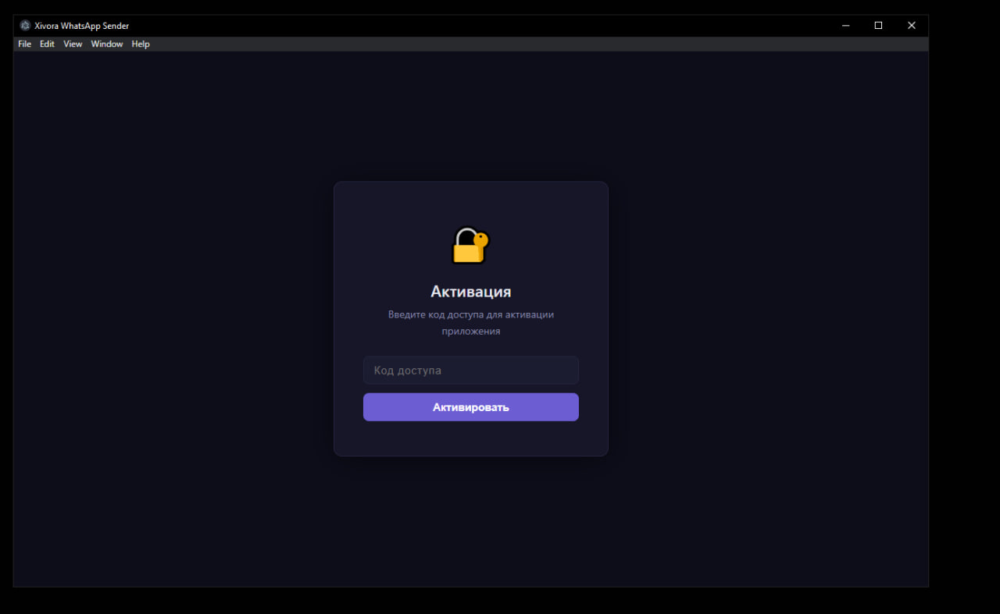
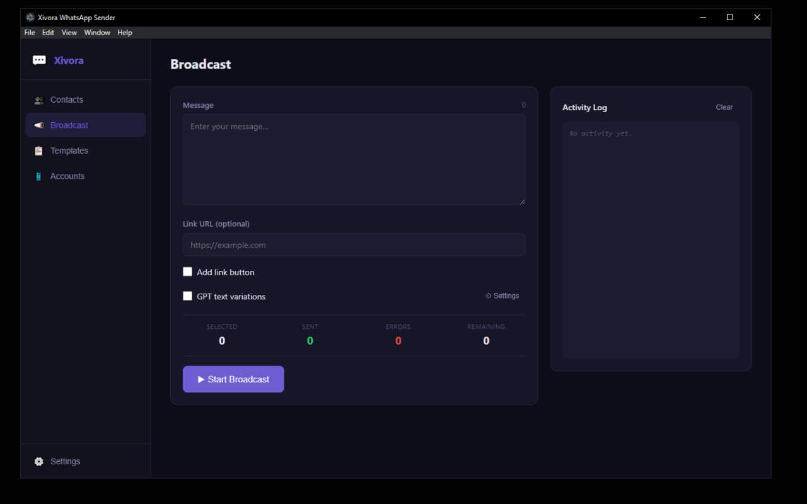
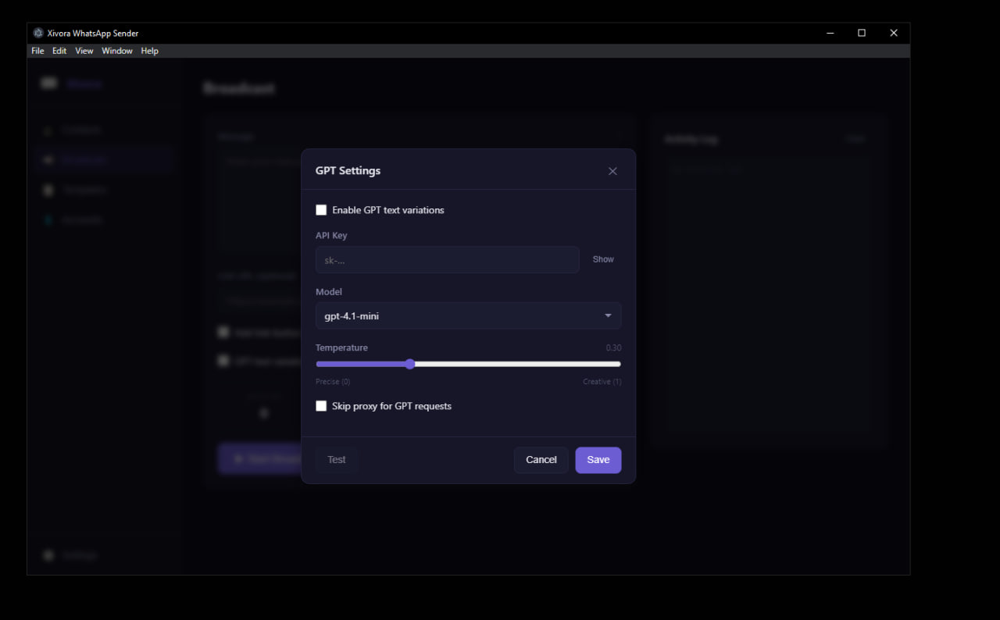
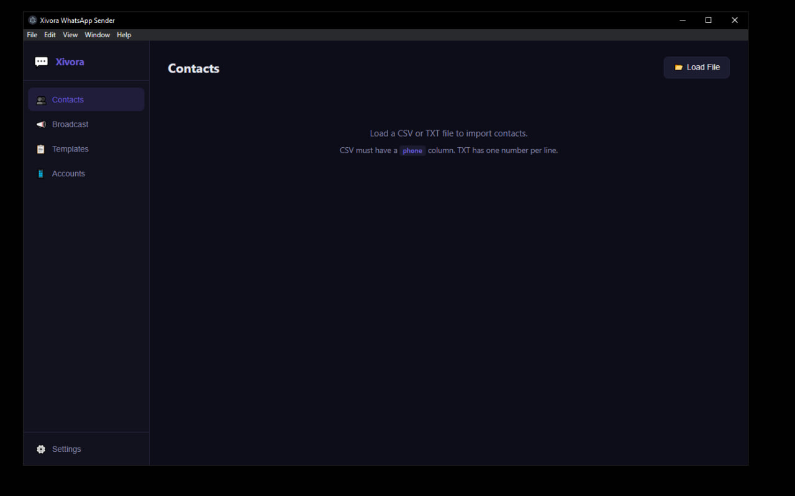
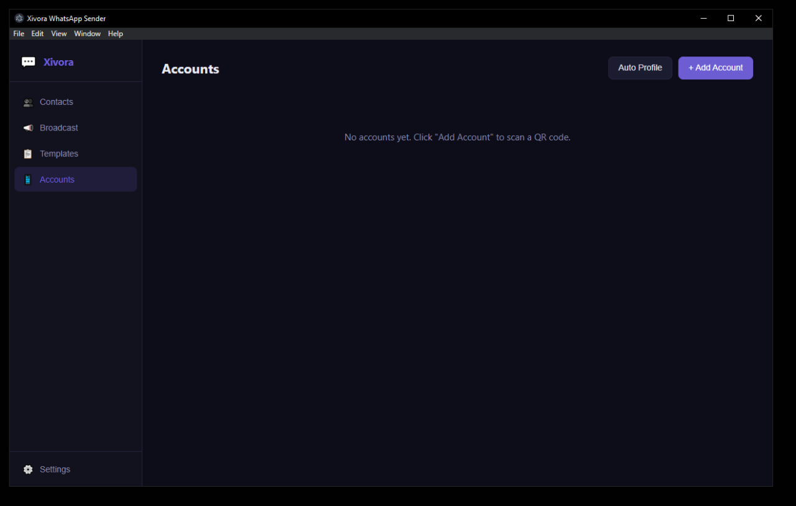
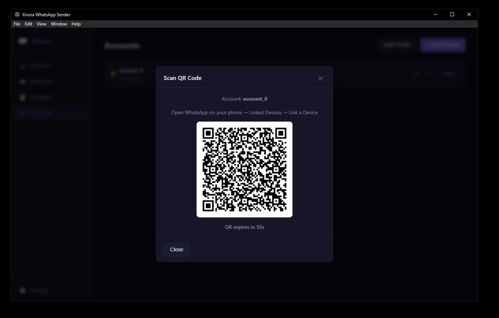
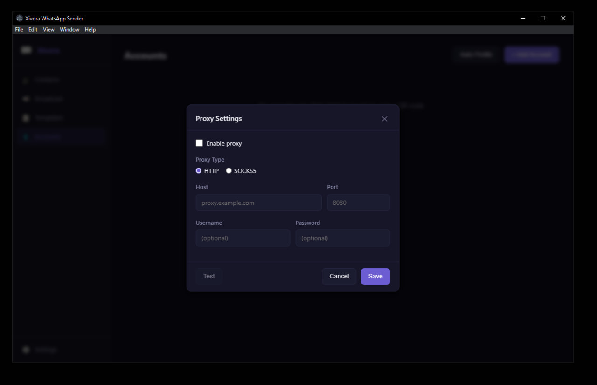

# Xivora WhatsApp Sender

> Профессиональный инструмент для массовых рассылок в WhatsApp с поддержкой множества аккаунтов, персонализации сообщений и AI-вариаций текста.

---

## Возможности

- **Мультиаккаунт** — подключите несколько WhatsApp-аккаунтов и распределяйте нагрузку между ними
- **Массовая рассылка** — отправляйте сообщения сотням контактов за один запуск
- **Международные номера** — поддержка любых форматов из любой страны (`+7`, `+1`, `+971`, `+44` и т.д.)
- **Контакты с именами** — укажите имя к каждому номеру: `+971501234567, Emaar`
- **Персонализация** — каждому контакту автоматически добавляется имя: `Emaar, {текст}`
- **AI-вариации** — каждый контакт получает уникальный вариант сообщения
- **DeepSeek через Groq (бесплатно)** — AI-вариации без оплаты через Groq free tier
- **OpenAI / DeepSeek** — поддержка платных провайдеров с вашим ключом
- **Шаблоны** — сохраняйте и переиспользуйте готовые тексты
- **Импорт контактов** — загрузка списков из CSV/TXT файлов
- **Прокси** — поддержка прокси-серверов для каждого аккаунта
- **Activity Log** — журнал отправок в реальном времени
- **Лицензионная защита** — привязка к устройству, управление через сервер

---

## Скриншоты

### Активация
Одноразовый ввод кода доступа при первом запуске. Код привязывается к устройству.



### Рассылка
Составьте сообщение, добавьте ссылку с кнопкой, включите AI-вариации и запустите рассылку.



### AI-настройки (DeepSeek / GPT)
Выберите провайдера, укажите API-ключ и настройте ползунок креативности. Groq — бесплатно.



### Контакты
Импортируйте контакты из CSV/TXT с именами, выбирайте нужные галочками перед рассылкой.



### Аккаунты
Управляйте подключёнными WhatsApp-аккаунтами. Добавляйте новые через QR-код.



### Подключение аккаунта (QR)
Отсканируйте QR-код через WhatsApp на телефоне: **Связанные устройства → Привязать устройство**.



### Настройка прокси
Укажите прокси для каждого аккаунта, чтобы снизить риск блокировки.



---

## Установка

### Требования
- Windows 10 / 11
- [Python 3.11+](https://python.org/downloads) — при установке обязательно отметить **"Add Python to PATH"**

### Шаги

1. Запустите `install_requirements.bat` — установит все зависимости
2. Запустите `Xivora WhatsApp Sender Setup 1.0.0.exe` — установит приложение
3. Запустите приложение
4. Введите полученный **код доступа** и нажмите **Активировать**

---

## Получение кода доступа

Код доступа выдаётся разработчиком. Без действующего кода запуск приложения невозможен.

По вопросам приобретения: **@Xivora**

---

## Использование

### Добавление аккаунта WhatsApp
1. Перейдите во вкладку **Accounts**
2. Нажмите **Add Account**
3. Откройте WhatsApp на телефоне → **три точки → Связанные устройства → Привязать устройство**
4. Наведите камеру на QR-код в приложении
5. Статус аккаунта сменится на **connected**

### Импорт контактов
Поддерживаются любые международные номера телефонов.

**TXT формат** — один контакт на строку:
```
+971501234567
+971501234567, Emaar
+79161234567, Иван
+15551234567, John
```

**CSV формат** — колонки `phone` и `name`:
```csv
phone,name
+971501234567,Emaar
+79161234567,Иван
```

### Персонализация сообщений
Если у контакта указано имя, оно автоматически добавляется перед текстом:
```
Emaar, Добрый день! Специальное предложение для вас...
Иван, Добрый день! Эксклюзивное предложение...
```

### AI-вариации (DeepSeek / GPT)
1. Нажмите **Settings** рядом с чекбоксом GPT text variations
2. Выберите провайдера:
   - **Groq (бесплатно)** — DeepSeek R1, регистрация на [console.groq.com](https://console.groq.com)
   - **DeepSeek** — стартовые бесплатные кредиты, ключ на [platform.deepseek.com](https://platform.deepseek.com)
   - **OpenAI** — платный, ключ на [platform.openai.com](https://platform.openai.com)
3. Введите API-ключ
4. Настройте ползунок **Creativity** (0 — точная копия, 1 — максимально творчески)
5. Каждому контакту будет отправлен уникальный вариант вашего сообщения

### Рассылка
1. Перейдите во вкладку **Broadcast**
2. Введите текст сообщения
3. Опционально: добавьте ссылку и включите **Add link button**
4. Опционально: включите **GPT text variations**
5. Нажмите **Start Broadcast**
6. Наблюдайте за прогрессом в **Activity Log** справа

### Шаблоны
- Сохраняйте часто используемые тексты во вкладке **Templates**
- Нажмите **Use** у нужного шаблона — текст подставится в поле Broadcast автоматически

### Прокси
- В настройках аккаунта укажите прокси в формате `host:port` или `user:pass@host:port`

---

## Частые вопросы

**Q: Приложение не запускается / чёрный экран**
A: Убедитесь, что запустили `install_requirements.bat` перед установкой. Python должен быть добавлен в PATH.

**Q: QR-код не появляется**
A: Подождите 5–10 секунд. Если не появился — удалите аккаунт и добавьте заново.

**Q: "Не удалось подключиться к серверу" при активации**
A: Проверьте подключение к интернету. Лицензионный сервер должен быть доступен.

**Q: "Доступ заблокирован"**
A: Ваш код доступа был деактивирован. Обратитесь к разработчику: **@Xivora**

**Q: Номер телефона не принимается**
A: Убедитесь что номер начинается с `+` и кода страны. Пример: `+971501234567`

---

## Контакты

Telegram: **@Xivora**
